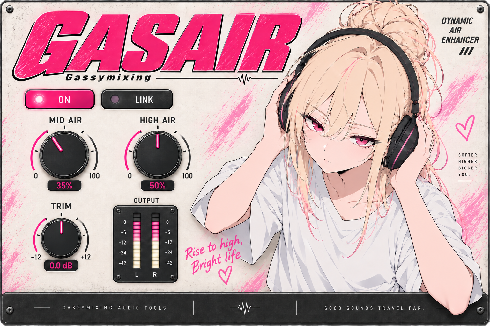

# GASAIR 1.0.3 — Gassymixing

Windows x64 VST3 动态高频增强效果器。采用独立开发的处理算法，目标是获得中高频存在感和高频空气感；并非 Fresh Air 的源码移植，也不承诺相同参数下声音或反相结果一致。

## 安装

1. 完整解压 `GASAIR-1.0.3-Windows-x64.zip`，不要直接在压缩包内运行安装文件。
2. 关闭音频宿主，双击 `Install-GASAIR.cmd`，允许 Windows 管理员权限提示。
3. 安装到 `C:\Program Files\Common Files\VST3\GASAIR.vst3`。重新打开宿主并扫描 VST3，厂商为 Gassymixing。

也可手动复制整个 `GASAIR.vst3` 文件夹到上述 VST3 目录。不要只复制里面的同名二进制文件。

安装器仅处理 GASAIR；与 GASBOOM、Fresh Air 的名称及 VST3 标识均不同。重装时原 GASAIR 备份在 `C:\ProgramData\Gassymixing\GASAIR\Backups`。卸载时先关闭宿主，再移除安装目录中的 GASAIR.vst3 文件夹即可。

## 控件

- **MID AIR**：0–100%，提升中高频细节和存在感。
- **HIGH AIR**：0–100%，提升高频明亮度和空气感。
- **TRIM**：−12 至 +12 dB，补偿处理后的响度；初始 0 dB。
- **ON / OFF**：整个处理链的开关，包括 TRIM。切换做短暂平滑，稳定在 OFF 后输出原始信号。
- **LINK**：联动界面上的两个 AIR 旋钮，保持当前差值；一端到达边界时两者一起停止。已录制的宿主自动化仍分别控制两个参数。
- **OUTPUT L/R**：输出峰值电平，刻度 −48 至 0 dBFS，顶部红灯表示达到或超过 0 dBFS，保持约一秒。插件不包含砖墙限幅器，可以用 TRIM 调低输出。

旋钮上下拖动、滚轮调整；按住 Shift 可精调；双击旋钮恢复初始值。点击数字可直接输入。直接拖动插件右边框、下边框或右下角斜线手柄可等比例放大缩小，也支持宿主窗口的尺寸拖动。范围 50%–150%，每次打开默认 50%（768×512，系统 DPI 缩放另计）。旧工程的历史窗口比例不再恢复；打开后仍可拖动边框调整。已移除比例菜单和 ZOOM 控件。工程保存保留音频参数；每次打开编辑器恢复默认大小。

新插入时 MID AIR 0%、HIGH AIR 0%、TRIM 0 dB；双击恢复这些初始值。已有工程中的音频参数正常恢复。两个 AIR 都设为 0 且 TRIM 为 0 dB 时，稳定后的输出等于输入。

## 本版范围

- 单声道或立体声；32 位和 64 位宿主音频缓冲；内部双精度运算。
- 无额外缓冲延迟；支持离线导出、宿主旁通、参数自动化和状态保存。
- 左右声道共用动态检测量，保持声像；参数、旁通平滑。
- 固定艺术面板，动态指针/弧线、数值、开关、电平；右侧手臂覆盖下方灰色边框。
- Windows x64 VST3，无 VST2、AU、AAX 或独立运行版本。

按本次交付要求，只进行编译与打包；未运行宿主、插件验证器、音频回归或试听测试。需要由使用者在自己的宿主中确认效果与兼容性。

`GASAIR-interface-artwork.png` 是正式版底图，不是宿主运行截图；真实控件由程序覆盖绘制。

## 原理与源码

信号保持一条原始通路，另用 2 kHz / 8 kHz 一阶 TPT 低通差分构造宽中高频与高频增强支路。两条增强支路使用左右声道共同的包络检测（2.5 ms 启动、90 ms 释放），按电平平滑减少强高频的额外增益，再与原信号并行混合。满量程低电平静态增益预算分别为约 9 dB 与 12 dB；实际频率响应受滤波、输入电平与并行叠加影响，不是固定搁架增益。没有加入随机噪声或固定波形失真。

公开资料参考：<https://docs.slatedigital.com/FreshAir/Fresh%20Air.html>。这些频率、时间和增益是 GASAIR 自己的设计选择，不能解释为 Fresh Air 内部参数。

对应源码包 `GASAIR-1.0.3-source.zip` 包含本项目、构建脚本及所用 SDK。具体构建方式见 `BUILD.md`。许可证见 `LICENSE.txt` 和 `THIRD-PARTY-NOTICES.txt`；保留各依赖自己的许可证。
